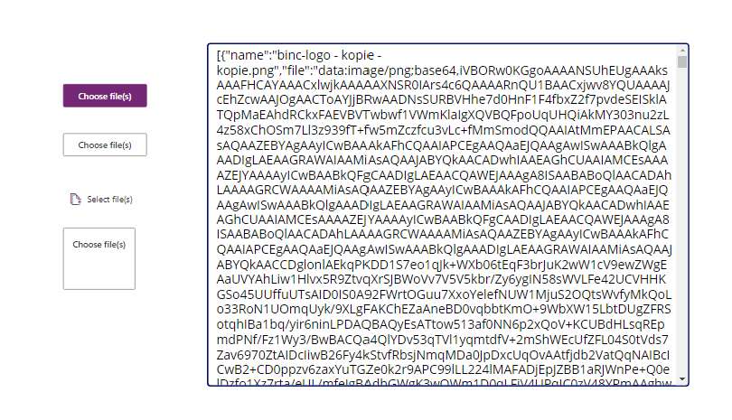
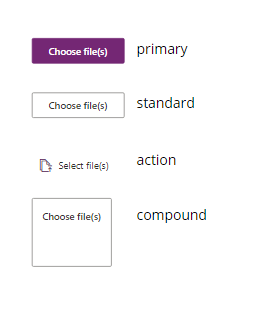

## File Uploader

A generic fluent UI button to trigger the native file selector. Outputs the selected files as data url.



### Howto get selected file data

The OnChange event is triggerd when selecting new files.
A array of the data will be available after selecting new files in the "files" parameter.
You can use the onChange event to track changes, and process the file data in e.g. power automate.

e.g.

Example 1


Example 2

```
ForAll(
    ParseJSON(Self.files);
    // Do something with data
    // ThisItem.name
    // ThisItem.file
)
;;
```

### Parameters

#### Label button

Label to show on the button

> Default = "Choose file(s)"

#### Allow multiple files

Allow the user to select multiple files at once

> Default = "true"

#### Allowed formats

Allowed formats to select.

e.g. image/png,image/jpeg

Please refer to [this media type list](http://www.iana.org/assignments/media-types/media-types.xhtml) for file types.

> Default = "all"

#### ID of the button

HTML id of the input field.
May be handy when adding multiple upload buttons.

> Default = "xe-uploadfile-button"

#### Button type

Refers to type of button.

> Default = "primary"

##### Types



#### Action icon

Can be used in combination with the "action" button type.
Refer to the [Fluent UI Icon tool](https://uifabricicons.azurewebsites.net/) for icon names.

> Default = "BulkUpload"

#### Files

Array of selected files.
Data url can be used to process files.

```
[
    {
        name: 'name of the file',
        data: 'data url of the file'
    }
]
```
